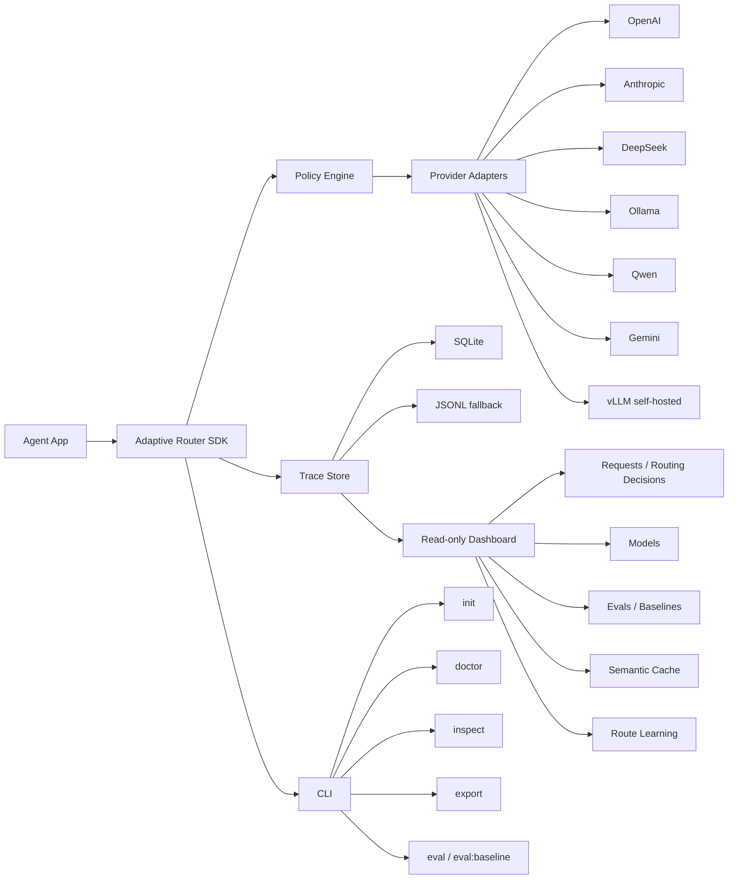

# Adaptive Model Router

[](https://github.com/guangyang1206/adaptive-model-router/actions/workflows/ci.yml)
[](LICENSE)
[](package.json)
[](ROADMAP.md)

> An adaptive model router for agent apps — automatically balancing quality, stability, latency, and token cost.

Adaptive Model Router is an SDK-first open-source developer tool for Agent applications. It embeds model routing into your agent runtime, chooses a model based on task context and capability constraints, records fallback attempts, and explains each routing decision in a local dashboard.

```text
Install SDK -> Initialize Router -> Send Agent Request -> Route by Quality/Stability -> Inspect Decision in Dashboard
```

## Why this exists

Agent apps often need different models for different steps: planning, tool calling, coding, extraction, summarization, and final answers. Hard-coding one model is either expensive or unreliable. Existing gateways are useful, but they often sit outside the agent loop and cannot easily see agent step metadata.

Adaptive Model Router focuses on an embeddable routing layer that can see agent context and make explainable routing decisions.

## What it can do today

**Core routing (MVP-0/1)**

- Route agent requests through a TypeScript SDK
- Score candidates by capability, model tier, health/success signal, latency, and cost
- Fall back on retryable non-streaming failures
- Normalize OpenAI, Anthropic, Gemini, DeepSeek, Qwen, vLLM, and Ollama provider calls
- Store traces with SQLite or JSONL fallback
- Open a local read-only dashboard (Requests, Models — with filtering + model comparison)
- Inspect/export traces from a small CLI
- Drop into LangChain / LangGraph and the Vercel AI SDK with zero framework dependency

**Evaluation & optimization (MVP-2)**

- **Eval harness** — run golden datasets through the router, compute deterministic
  routing metrics, and gate against a saved baseline (regression = CI fail)
- **Semantic cache** — exact + embedding cosine reuse, per-tenant isolation, TTL,
  and a negative-word guard; degrades to exact-match honestly when no real
  embedding provider is available (never silent)
- **Route-outcome learning** — offline, human-in-the-loop weight proposer with
  per-dimension bounds, an eval-gate, and one-click rollback. Learned weights are
  **never auto-adopted**; a human calls `adoptWeights` explicitly
- **Zero-dependency embeddings** — OpenAI (fetch-only) → local transformers ONNX
  → deterministic hashing fallback, resolved lazily so routers that never touch
  the cache pay nothing

## Dashboard demo


[Watch the short dashboard recording](docs/assets/dashboard-demo.webm)

The screenshot above is captured from the real local dashboard with seeded route traces. You can regenerate the demo locally after building the dashboard package:

```bash
node scripts/preview-dashboard-demo.mjs
```

## Quick demo

```ts
import { createDashboard, createReadOnlyDataAccess } from '@adaptive-router/dashboard'
import {
  createAnthropicProvider,
  createDeepSeekProvider,
  createGeminiProvider,
  createOllamaProvider,
  createOpenAIProvider,
  createQwenProvider,
  createVLLMProvider,
  createRouter,
  createSQLiteTraceStore,
} from '@adaptive-router/sdk'

const store = await createSQLiteTraceStore({
  path: '.adaptive-router/router.db',
  fallbackPath: '.adaptive-router/router.jsonl',
})

const router = createRouter({
  providers: [
    createOpenAIProvider({ apiKey: process.env.OPENAI_API_KEY }),
    createAnthropicProvider({ apiKey: process.env.ANTHROPIC_API_KEY }),
    createGeminiProvider({ apiKey: process.env.GEMINI_API_KEY }),
    createDeepSeekProvider({ apiKey: process.env.DEEPSEEK_API_KEY }),
    createQwenProvider({ apiKey: process.env.DASHSCOPE_API_KEY }),
    createOllamaProvider({ baseURL: process.env.OLLAMA_BASE_URL }),
    // Self-hosted vLLM: point at your OpenAI-compatible server and name the
    // served model. No apiKey needed unless you started vLLM with --api-key.
    createVLLMProvider({
      baseURL: process.env.VLLM_BASE_URL ?? 'http://localhost:8000/v1',
      model: 'meta-llama/Llama-3.1-8B-Instruct',
    }),
  ],
  policy: {
    defaultQuality: 'balanced',
    stability: 'high',
    costMode: 'optimize-within-quality-threshold',
  },
  store,
})

const result = await router.chat({
  messages: [{ role: 'user', content: 'Plan the next coding task.' }],
  route: {
    task: 'plan',
    quality: 'high',
    stability: 'high',
    latencyMs: 8000,
    maxCostUsd: 0.05,
    explain: true,
  },
})

console.log(result.routerTrace)

const dashboard = await createDashboard({
  data: createReadOnlyDataAccess({
    listTraces: () => router.traces(),
    listModels: () => router.models(),
  }),
})

console.log(dashboard.url)
```

## Use it inside LangChain / LangGraph

`createLangChainModel(router)` wraps the router as a LangChain-compatible chat
model — no `@langchain/core` dependency required. It accepts the message shapes
LangChain and LangGraph already produce (plain strings, `[role, content]`
tuples, OpenAI-style objects, or `BaseMessage`s) and returns an `AIMessage`-like
value that also carries the full `routerTrace`, so the router's explainability
survives the framework hop.

```ts
import { createLangChainModel, createRouter } from '@adaptive-router/sdk'

const model = createLangChainModel(router, { route: { quality: 'high' } })

const ai = await model.invoke([
  ['system', 'You are concise.'],
  ['human', 'Plan the next coding task.'],
])

console.log(ai.content)            // assistant text
console.log(ai.routerTrace.chosenModel) // which model the router picked, and why
```

Drop the same `model` into a LangGraph node — its `invoke`/`batch` methods and
`AIMessage`-shaped output work with the `add_messages` reducer out of the box.

## Use it inside the Vercel AI SDK

`createVercelModel(router)` wraps the router as a Vercel AI SDK `LanguageModelV1`
— no `ai` package dependency required. Pass it straight to `generateText` /
`streamText`; the router's `routerTrace` comes back through `providerMetadata`,
so explainability survives this framework hop too.

```ts
import { generateText } from 'ai'
import { createVercelModel, createRouter } from '@adaptive-router/sdk'

const model = createVercelModel(router, { route: { quality: 'high' } })

const { text, providerMetadata } = await generateText({
  model,
  prompt: 'Plan the next coding task.',
})

console.log(text)                                          // assistant text
console.log(providerMetadata.adaptiveRouter.routerTrace.chosenModel) // and why
```

`streamText` works as well — the MVP adapter emits the routed response as a
single text delta plus a finish event carrying usage and the trace.

## Architecture



## CLI

```bash
adaptive-router init
adaptive-router doctor
adaptive-router inspect
adaptive-router export --out .adaptive-router/diagnostic-export.json

# MVP-2: run a golden dataset and gate it against the saved baseline
adaptive-router eval datasets/routing.json --baseline
adaptive-router eval:baseline save datasets/routing.json

adaptive-router --help      # or -h
adaptive-router --version   # or -v
```

The CLI helps initialize local config, check provider environment variables,
inspect JSONL trace summaries (including cache hit-rate), export diagnostics,
and run the eval harness with regression gating.

## Design principles (scope discipline)

The project ships in locked milestones. A few principles hold across all of them:

- TypeScript SDK-first, not proxy-first
- Quality-gated routing based on capability, tier, health, and success signals
- Fallback / retry / timeout for non-streaming requests; no mid-stream fallback
- SQLite storage with JSONL fallback
- **Zero-dependency core SDK** — optional peers (embeddings ONNX, `node:sqlite`)
  are loaded through a dynamic-import shim so a bundler can never pull them in
- **Honest degradation** — every downgrade (cache exact-only, hashing embeddings,
  storage error) is recorded in the trace `notes`; nothing degrades silently
- English-first bilingual docs: README, Quickstart, API Reference

## Not yet (deferred to MVP-3+)

- No hosted SaaS dashboard
- No RBAC, multi-tenant orgs, audit logs, or billing
- No model marketplace
- No real-time LLM judgment of answer quality in the hot path (the eval harness
  runs offline; an LLM-judge plugin hook exists but is opt-in)
- No prompt / context compression yet
- No local proxy / HTTP bridge yet
- No full provider coverage

## Package plan

```text
@adaptive-router/sdk        Runtime SDK, policy, providers, storage, telemetry
@adaptive-router/dashboard  Local read-only dashboard
@adaptive-router/cli        Developer helper commands
```

## Roadmap

| Stage | Focus | Status |
|---|---|---|
| MVP-0 | SDK routing, providers, durable storage, local dashboard, CLI | ✅ Complete |
| MVP-1 | Framework adapters (LangChain / Vercel AI SDK), more providers (Gemini / Qwen / vLLM), dashboard filtering + model comparison | ✅ Complete |
| MVP-2 | Eval harness + baseline gating, semantic cache, route-outcome learning (human-in-the-loop) | ✅ Complete |
| MVP-3 | Team / enterprise / SaaS control plane | ⬜ Next |

See [ROADMAP.md](ROADMAP.md) for the detailed, status-tracked breakdown of every item.

## Contributing

Start here:

- [Contributor Tasks](CONTRIBUTOR_TASKS.md)
- [Good first issue drafts](.github/ISSUE_DRAFTS/README.md)
- [Contributing Guide](CONTRIBUTING.md)

Useful starter areas:

- routing policy examples
- dashboard empty states
- CLI help snapshots
- LangChain ✅ / Vercel AI SDK ✅ framework adapters
- SQLite compatibility
- CI matrix expansion

## Documentation

- [English Quickstart](docs/en/quickstart.md)
- [中文快速开始](docs/zh/quickstart.md)
- [English API Reference](docs/en/api-reference.md)
- [中文 API 参考](docs/zh/api-reference.md)
- [Roadmap](ROADMAP.md)

## Status

The core developer loop is proven end to end, and MVP-2 has landed:

```text
init config -> route agent request -> store traces -> inspect dashboard -> export diagnostics
                     ↓
            run eval harness -> gate against baseline -> propose weights (human adopts)
```

**MVP-0, MVP-1, and MVP-2 are all complete and on `main`.** The router does
quality-gated routing across seven providers, plugs into LangChain/LangGraph and
the Vercel AI SDK, and now adds an eval harness with baseline regression gating,
a degradation-honest semantic cache, and human-in-the-loop route-outcome
learning — all while keeping the core SDK zero-dependency and byte-for-byte
compatible with the original MVP-1 scoring.

Development runs through a quality-gated workflow — every change passes
lint → typecheck → build → test → smoke and lands on `main` via a reviewed,
squash-merged PR. Next up is **MVP-3** (team / enterprise / SaaS control plane).
See [WORKFLOW.md](WORKFLOW.md) and [ROADMAP.md](ROADMAP.md).

## License

Apache-2.0

---

## 中文简介

Adaptive Model Router 是一个面向 Agent 应用的 SDK-first 开源开发者工具。它嵌入 Agent runtime 内部，根据任务上下文、模型能力、质量档位、稳定性、延迟和成本进行可解释路由，并通过本地 Dashboard 展示每次请求为什么选择某个模型。

目前 MVP-0 / MVP-1 / MVP-2 均已完成并合入 `main`：

- **MVP-0/1**：TypeScript SDK、质量门控路由、fallback/retry/timeout、本地只读 Dashboard（含请求筛选与模型对比）、SQLite/JSONL 记录、七个 provider（OpenAI、Anthropic、DeepSeek、Ollama、Gemini、Qwen、自托管 vLLM），以及零依赖的 LangChain/LangGraph 与 Vercel AI SDK 适配器。
- **MVP-2**：评估工具链（golden 数据集 + 确定性指标 + 基线回归门禁）、语义缓存（精确匹配 + 向量余弦复用、多租户隔离、TTL、否定词防护，无可信 embedding 时诚实降级为精确匹配、绝不静默）、路由结果学习（离线、人在环、带上下界与评估门禁的权重提议器，学到的权重永不自动采用，需人工显式 `adoptWeights`）。

两条工程底线贯穿始终：**核心 SDK 零运行时依赖**（可选的 embeddings ONNX、`node:sqlite` 通过动态 import shim 加载，打包器无法静态引入），以及**诚实降级**（任何降级都会写入 trace `notes`）。项目文档采用英文优先、中英双语策略。下一步进入 **MVP-3**（团队 / 企业 / SaaS 控制面）。
