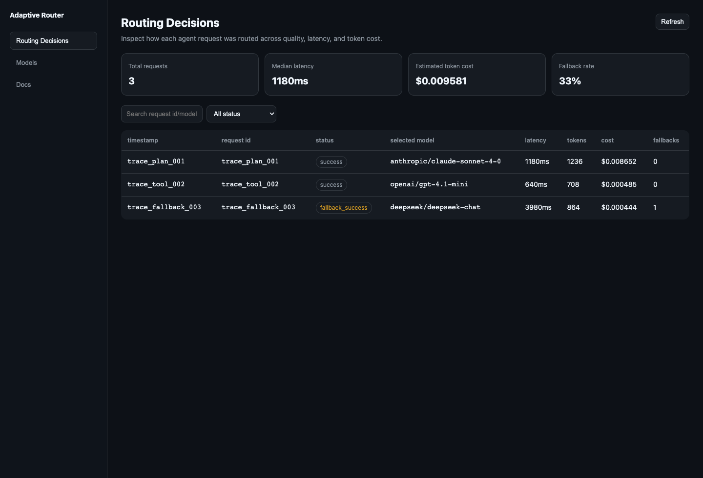
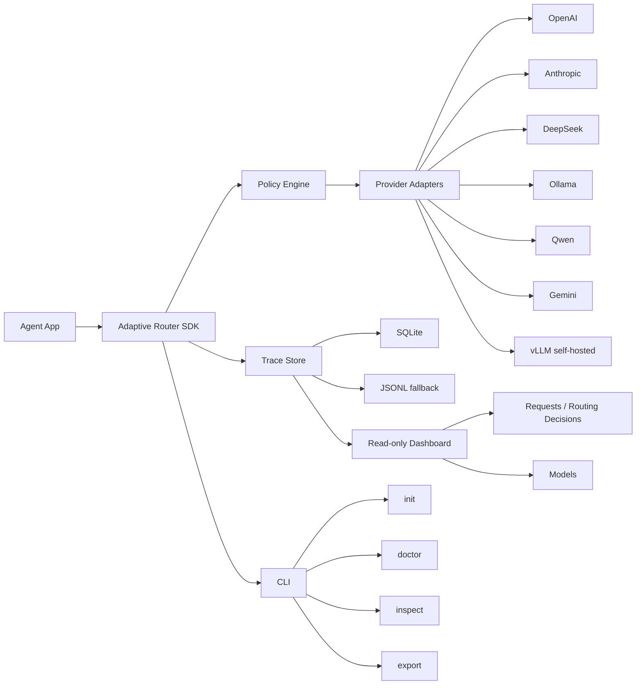

# Adaptive Model Router

[](https://github.com/guangyang1206/adaptive-model-router/actions/workflows/ci.yml)
[](LICENSE)
[](package.json)
[](ROADMAP.md)

> An adaptive model router for agent apps — automatically balancing quality, stability, latency, and token cost.

Adaptive Model Router is an SDK-first open-source developer tool for Agent applications. It embeds model routing into your agent runtime, chooses a model based on task context and capability constraints, records fallback attempts, and explains each routing decision in a local dashboard.

```text
Install SDK -> Initialize Router -> Send Agent Request -> Route by Quality/Stability -> Inspect Decision in Dashboard
```

## Why this exists

Agent apps often need different models for different steps: planning, tool calling, coding, extraction, summarization, and final answers. Hard-coding one model is either expensive or unreliable. Existing gateways are useful, but they often sit outside the agent loop and cannot easily see agent step metadata.

Adaptive Model Router focuses on an embeddable routing layer that can see agent context and make explainable routing decisions.

## What MVP-0 can do

- Route agent requests through a TypeScript SDK
- Score candidates by capability, model tier, health/success signal, latency, and cost
- Fall back on retryable non-streaming failures
- Normalize OpenAI, Anthropic, Gemini, DeepSeek, Qwen, vLLM, and Ollama provider calls
- Store traces with SQLite or JSONL fallback
- Open a local read-only dashboard with Requests and Models pages
- Inspect/export traces from a small CLI

## Dashboard demo



[Watch the short dashboard recording](docs/assets/dashboard-demo.webm)

The screenshot above is captured from the real local dashboard with seeded route traces. You can regenerate the demo locally after building the dashboard package:

```bash
node scripts/preview-dashboard-demo.mjs
```

## Quick demo

```ts
import { createDashboard, createReadOnlyDataAccess } from '@adaptive-router/dashboard'
import {
  createAnthropicProvider,
  createDeepSeekProvider,
  createGeminiProvider,
  createOllamaProvider,
  createOpenAIProvider,
  createQwenProvider,
  createVLLMProvider,
  createRouter,
  createSQLiteTraceStore,
} from '@adaptive-router/sdk'

const store = await createSQLiteTraceStore({
  path: '.adaptive-router/router.db',
  fallbackPath: '.adaptive-router/router.jsonl',
})

const router = createRouter({
  providers: [
    createOpenAIProvider({ apiKey: process.env.OPENAI_API_KEY }),
    createAnthropicProvider({ apiKey: process.env.ANTHROPIC_API_KEY }),
    createGeminiProvider({ apiKey: process.env.GEMINI_API_KEY }),
    createDeepSeekProvider({ apiKey: process.env.DEEPSEEK_API_KEY }),
    createQwenProvider({ apiKey: process.env.DASHSCOPE_API_KEY }),
    createOllamaProvider({ baseURL: process.env.OLLAMA_BASE_URL }),
    // Self-hosted vLLM: point at your OpenAI-compatible server and name the
    // served model. No apiKey needed unless you started vLLM with --api-key.
    createVLLMProvider({
      baseURL: process.env.VLLM_BASE_URL ?? 'http://localhost:8000/v1',
      model: 'meta-llama/Llama-3.1-8B-Instruct',
    }),
  ],
  policy: {
    defaultQuality: 'balanced',
    stability: 'high',
    costMode: 'optimize-within-quality-threshold',
  },
  store,
})

const result = await router.chat({
  messages: [{ role: 'user', content: 'Plan the next coding task.' }],
  route: {
    task: 'plan',
    quality: 'high',
    stability: 'high',
    latencyMs: 8000,
    maxCostUsd: 0.05,
    explain: true,
  },
})

console.log(result.routerTrace)

const dashboard = await createDashboard({
  data: createReadOnlyDataAccess({
    listTraces: () => router.traces(),
    listModels: () => router.models(),
  }),
})

console.log(dashboard.url)
```

## Architecture



## CLI MVP

```bash
adaptive-router init
adaptive-router doctor
adaptive-router inspect
adaptive-router export --out .adaptive-router/diagnostic-export.json
```

The CLI helps initialize local config, check provider environment variables, inspect JSONL trace summaries, and export diagnostics.

## MVP-0 scope

The first milestone is intentionally small:

- TypeScript SDK-first, not proxy-first
- Quality-gated routing based on capability, tier, health, and success signals
- Fallback / retry / timeout for non-streaming requests
- No mid-stream fallback after streaming has started
- Local read-only dashboard with two pages:
  - Requests / Routing Decisions
  - Models
- SQLite storage with JSONL fallback
- First provider set: OpenAI, Anthropic, DeepSeek, Ollama
- English-first bilingual docs: README, Quickstart, API Reference

## Non-goals for MVP-0

- No hosted SaaS dashboard
- No RBAC, multi-tenant orgs, audit logs, or billing
- No model marketplace
- No real-time judgment of answer quality
- No learning router or eval-driven routing yet
- No full provider coverage
- No local proxy in MVP-0

## Package plan

```text
@adaptive-router/sdk        Runtime SDK, policy, providers, storage, telemetry
@adaptive-router/dashboard  Local read-only dashboard
@adaptive-router/cli        Developer helper commands
```

## Roadmap

| Stage | Focus | Status |
|---|---|---|
| MVP-0 | SDK routing, providers, durable storage, local dashboard, CLI | ✅ Complete |
| MVP-1 | Framework adapters, more providers (Gemini ✅ / Qwen ✅ / vLLM ✅), dashboard filtering | 🔵 In progress |
| MVP-2 | Eval harness, route learning, cache, context compression | ⬜ Planned |
| MVP-3 | Team / enterprise / SaaS control plane | ⬜ Future |

See [ROADMAP.md](ROADMAP.md) for the detailed, status-tracked breakdown of every item.

## Contributing

Start here:

- [Contributor Tasks](CONTRIBUTOR_TASKS.md)
- [Good first issue drafts](.github/ISSUE_DRAFTS/README.md)
- [Contributing Guide](CONTRIBUTING.md)

Useful starter areas:

- routing policy examples
- dashboard empty states
- CLI help snapshots
- LangChain / Vercel AI SDK framework adapters
- SQLite compatibility
- CI matrix expansion

## Documentation

- [English Quickstart](docs/en/quickstart.md)
- [中文快速开始](docs/zh/quickstart.md)
- [English API Reference](docs/en/api-reference.md)
- [中文 API 参考](docs/zh/api-reference.md)
- [Roadmap](ROADMAP.md)

## Status

MVP-0 is **functionally complete** — the core developer loop is proven end to end:

```text
init config -> route agent request -> store traces -> inspect dashboard -> export diagnostics
```

The project is now in **MVP-1**, expanding provider and framework coverage
(Gemini, Qwen, and self-hosted vLLM shipped; LangChain and Vercel AI SDK
adapters next).
Development runs through a quality-gated workflow — every change passes
lint → typecheck → build → test → smoke and lands on `main` via a reviewed,
squash-merged PR. See [WORKFLOW.md](WORKFLOW.md) and [ROADMAP.md](ROADMAP.md).

## License

Apache-2.0

---

## 中文简介

Adaptive Model Router 是一个面向 Agent 应用的 SDK-first 开源开发者工具。它嵌入 Agent runtime 内部，根据任务上下文、模型能力、质量档位、稳定性、延迟和成本进行可解释路由，并通过本地 Dashboard 展示每次请求为什么选择某个模型。

MVP-0 聚焦 TypeScript SDK、质量门控路由、fallback/retry/timeout、本地只读 Dashboard、SQLite/JSONL 记录，以及 OpenAI、Anthropic、DeepSeek、Ollama 四个首批 provider。项目文档采用英文优先、中英双语策略。
